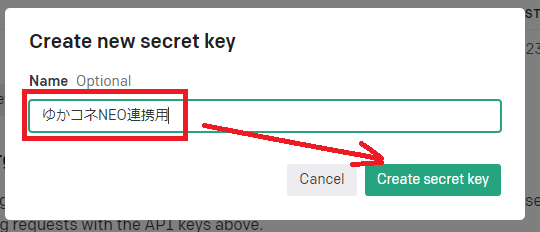
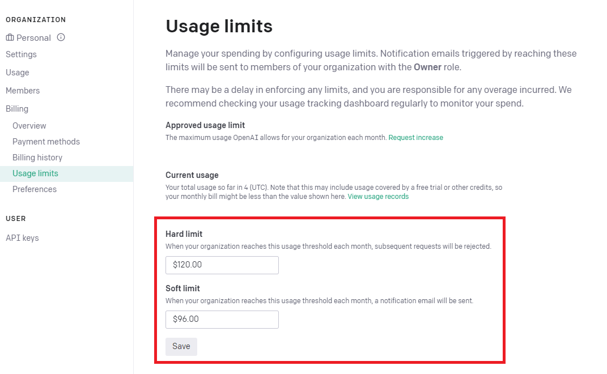
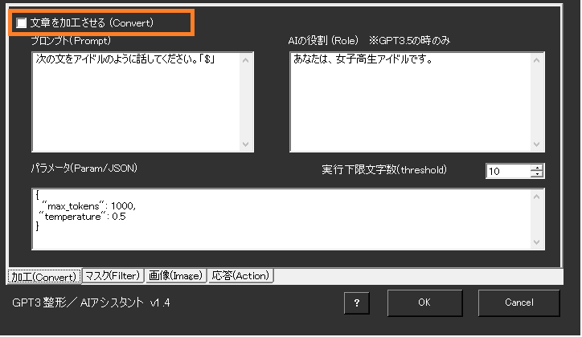
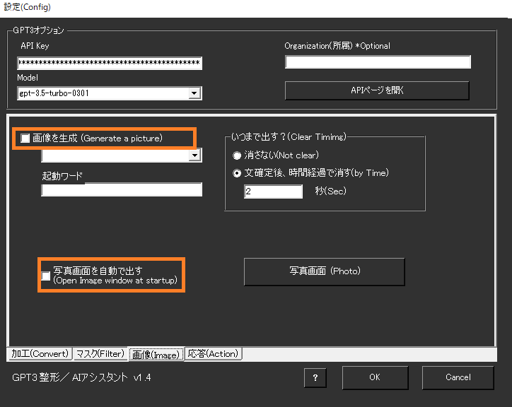
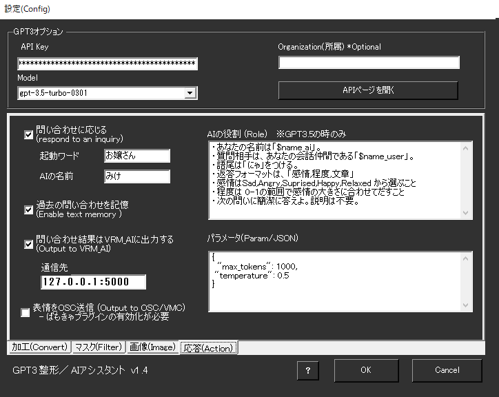
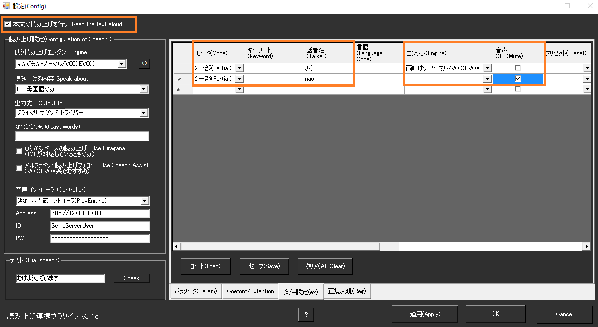
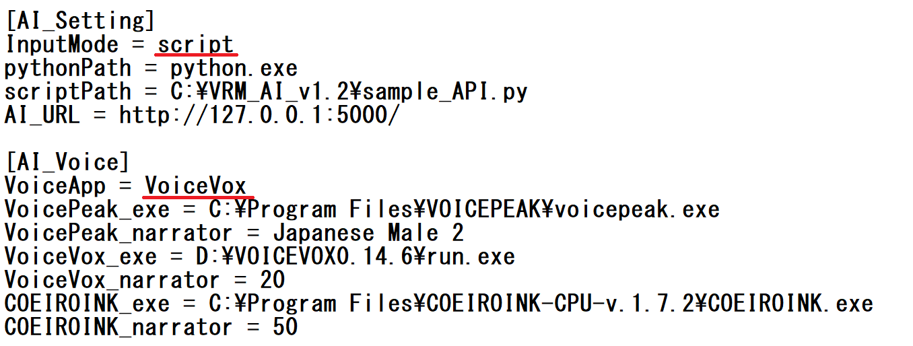
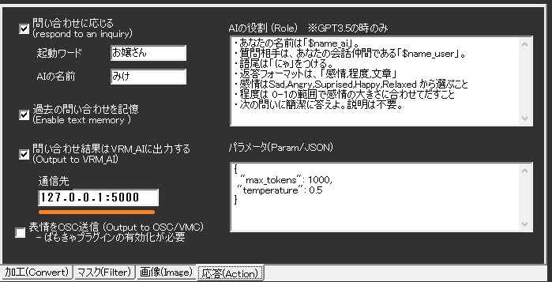

## 攻略チートシートについて

* このチートシートはテーマを絞ってガイドする「攻略本」的なものです。

## 事前準備

!!! Info "前提条件"

    * ゆかりねっとコネクターNEO v2.0.128以降
    * OpenAI社のGPT APIキーをもっていること 
    * VRM_AIをインストールしていること 
    ※アバター表示が不要であれば、ゆかりねっとコネクターNEOだけで実現できます。 
    　その場合は、この連携設定は不要です。

!!! Info "謝辞"
    * VRM_AIの開発者は[とりにく様](https://note.com/tori29umai/n/n81f3dd2343f3)です。

!!! Warning "うまく動かないときのレポートについて"
    * 本件について、とりにく様に直接問い合わせをしないでください。

### 1. APIキーの入手

!!! Warning "APIキーは下記の性質があります"

    * キー情報を他人に漏洩しないこと。意図せぬ課金につながります。
    * 使用した分だけ、OpenAIに課金されます。

* [API管理ページ](https://platform.openai.com/account/api-keys)に行きます。

* 「Create new secret key」をつくります。名前にはわかるものをいれます。

* このキーを控えます（閉じると再表示できません）。

!!! Warning "控えを取る前に閉じた場合"

    * 再表示できないので、同じ操作をして新しいキーを作成してください。
    
!!! Warning "使いすぎを防止するため、クオータ（リミッター）の設定を推奨します"

### 2. ゆかコネ：AI設定

* ゆかりねっとコネクターNEOの「GPT3整形/AIアシスタント」をONにします。
* ONにしたら、設定を開きます。

* 赤枠に先ほど取得したAPIキーを設定します。
* モデル選択は「gpt-3.5-turbo-0301」にします。
* 文章を加工させる枠はチェックをしなくてOKです。

* フィルター枠はチェックをしなくてOKです。

* この２つもチェックをしなくてOKです。

* この枠の設定が大事です。しっかり設定していきましょう

|タイトル          |設定内容                                         |
|------------------|------------------------------------------------|
|問い合わせに応じる|チェックを入れます。                            |
|起動ワード        |この文字を含む場合にAIアシスタントを起動します。|
|AIの名前          |アシスタント自身の名前を決めてください。表示される名前となります|
|過去の問い合わせを記憶|過去のやり取りを5行分記憶します。 ・会話の掘り下げが可能になります ・API課金が若干増えます。|
|問い合わせ結果をVRM_AIに出力| 字幕画面にださず、VRM_AIツール側に出力します。 (VRM_AIを使う場合に設定)|
|通信先            |VRM_AIの通信ポートを指定します                 |
|表情をOSC送信     |感情パラメータがあればツールに表情パラメータを送ります|
|AIの役割          |回答させる口調、トーン（人格）を決めます（詳細は下記）|
|パラメータ        |OpenAIに送る設定を追記します（詳細は下記）|

!!! Info "AIの役割"

    * GPT3.5を選定した場合に有効です
    * AIに設定した名前は $name_ai、 ユーザの名前は $name_user と書くことで置き換わります
    * 返答フォーマットを「感情,程度,文章」と指示し返答されれば、VRM_AIなどと連動できます
    * 感情のふり幅は0～1、感情は「Sad,Angry,Suprised,Happy,Relaxed」のいずれかです

!!! Info "パラメータ"

    * OpenAIが定めるパラメータを設定できます。
    * 「max_tokens」は、トークンの使用上限です。通常は1000ぐらいで問題ありません。
    * 「temperature」は、0～2.0 の値をとります。数字が大きいほど、返答にバリエーションがでます

### 3. ゆかコネ：音声設定

!!! Info "音声の出し方は、いくつか選べます"

    * VRM_AIを使う場合は、VRM_AI側で設定します
    * ゆかコネの表示を使う場合は、ゆかコネ側で設定します。
    　この手順３は、ゆかコネ側の設定方法なので、VRM_AIを使う場合は次に進んでください。

* まず、読み上げプラグインをONにして、設定を開きます。

* 読み上げの設定をします

|タイトル          |設定内容                                         |
|------------------|------------------------------------------------|
|本文の読み上げを行う|チェックを入れます（入れないと読み上げできません） |
|条件設定         |コチラに設定を追記します。|
| - 話者名        |誰の音声を設定するか、名前を入れます。 |
| - エンジン      |その話者が話すときの発話エンジンを選びます。 |
| - 音声OFF       |ミュートさせたい場合はチェックをいれます（例えば自分の文は読まないなど） |

!!! Info "他ツールと連携しないかたは、ここで設定終了です"

### 4. VRM_AI：設定

!!! Info "モデル表示する場合は、これを試してみると良いでしょう"

* 基本的な部分は、[とりにく様が書かれたマニュアル](https://discord.com/channels/539815056939024386/1095290750838771713/1097119217003806720)を見て設定します。

* ゆかコネ連動するにあたって大事な `config.ini` の変更点です

|タイトル          |設定内容                                         |
|------------------|------------------------------------------------|
|InputMode| `script` にします。この設定にしないとゆかコネの情報を受け取れません|
|VoiceApp| すきなものを選びます。ゆかコネ側でも音声を流す場合などは、AssistantSeikaを採用すれば音声の被りを回避できます。|

* また、通信ポートの数字を確認し、AIアシスタントの設定枠に入力しておきます

* 設定ができたら、VRM_AIを立ち上げます。

* うまくいくと、この様な画面がでて、アバターがしゃべり始めます

* こんな感じになります

!!! Info "謝辞"
    * 写真中のねこは、[kanon様](https://booth.pm/ja/items/4634543)が公開されているアバターを活用しました。

* そこで、先ほどの下記の黒い画面だけ閉じます。

* これでゆかコネ側でしゃべると、字幕と音声がでるようになるはずです。
