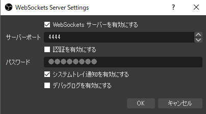
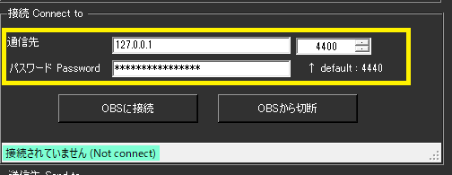
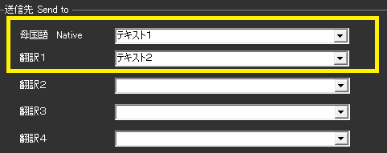
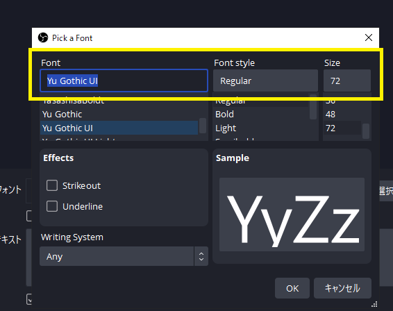

## 攻略チートシートについて

* このチートシートはテーマを絞ってガイドする「攻略本」的なものです。

## OBS Studioで字幕をきれいに出す
!!! Info "前提条件"
    * 配信にOBS Studioを使用している
    * OBS Studio のバージョンは v27以上
    * OBS WebSocket プラグインは Version 4.9.1
    * 音声認識で字幕が出るところまではセットアップ完了済

## 1.OBS StudioのWebSocket設定を有効にする

* OBSのツールメニューから、WebSocketのメニューを開きます。

* OBS WebSocketを有効にしてください。
* パスワードも必要に応じて設定します。（設定値は後ほど必要なので覚えておいて下さい）

## 2.字幕を出すためのテキストソースを作る

* OBS Studioのソース画面で字幕を表示させるためのテキストソースを作ります。
* 言語ごとに作る必要があるので、２言語出したい場合は、２つ作ります。
* ここで作ったソース名は後で必要になるので覚えておきましょう。

!!! Tip "落とし穴に注意"
    * ソースをグループ化するとうまく転送できないことがあるので、グループ化しないようにしましょう。

## 3.ゆかりねっとコネクターNEOのプラグインを有効にする

* プラグインのチェックを打って、有効にしてください。
* 有効にすべきプラグインは、OBSのバージョンによって異なります。

|OBS Studioのバージョン|有効にすべきプラグイン|
|:--------------------|:-------------------|
|～ v27               | WebSocket4         |
|v28 ～               | WebSokcet5         |

## 4.接続の設定をする

* 通信先は、通常 ``127.0.0.1`` もしくは ``localhost``でOKです。
* 通信ポートは 通常は ``4440`` です。
* パスワードを設定した場合はここに入力します。(パスワードはOBS Websocket側に入力したものと合わせます)

設定が終わったら、OBSに接続をおして「接続されました」となることを確認します。

!!! Warning "接続されましたにならない場合"
    * 通信ポートの番号が正しいかOBS側の設定を見て確認しましょう。
    * パスワードの設定が正しいか見直しましょう。

## 5.転送先の設定をする

* 転送先のソース名を選択します。うまく通信できていれば、プルダウンメニューの中にソース名があるので。選択するだけでOKです。

## 6.OBS側の見え方の設定

* フォントの設定をします。縁取りなども、OBS側の設定で実施可能です。

!!! Tips "OBS側の設定について"
    OBS側は設定のやり方がたくさんあるので、ここでは「よりきれいな見せ方」については割愛しています。他のサイトで紹介しているところが多数ありますので、そちらを参考にしてください。
