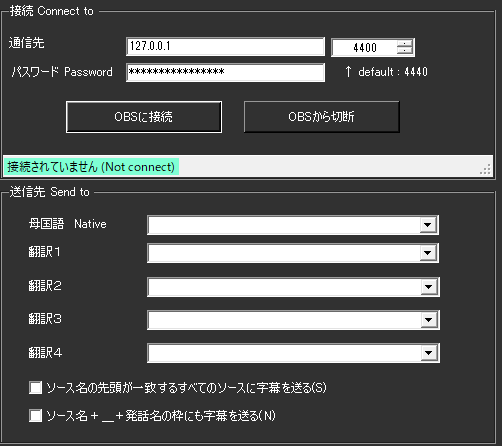

!!! Info "前提条件(OBS27)"
    * [OBS Studio v27](https://github.com/obsproject/obs-studio/releases/download/27.2.4/)までを使用していること
    * [OBS WebSocket v4.9.1/Qt5](https://github.com/obsproject/obs-websocket/releases/tag/4.9.1)が入っていること

!!! Info "前提条件(OBS28)"
    * [OBS Studio v28](https://github.com/obsproject/obs-studio/releases/download/28.0.2/)を使用していること
    * [OBS WebSocket v4.9.1/Qt6](https://github.com/obsproject/obs-websocket/releases/tag/4.9.1-compat)が入っていること

## このプラグインで出来ること

* OBS Studioの字幕レイアウトを直接書き換えることで字幕をきれいに表示できます

##　有効化


* プラグインを使うチェックをONにしてください。

!!! Warning "OBS WebSocket 5の環境ではこのプラグインは使えません"
    * OBS WebSocket 5 (OBS v28～)の環境で通信を開始するとフリーズします
    * OBSの通信仕様が大きく変わったためです。バージョンを確認して使ってください。
    * このプラグインの対象となるOBSの設定画面はこちら側です

    

## 設定



|設定|意味|
|:--|:---|
|通信先|字幕を送付したいOBSを指定します。<br>※ポート番号はバージョンによって``4440``・``4444``とばらつきがあるのでOBSで確認してください|
|パスワード|OBSの設定画面でパスワードを設定していれば入れます|
|送信先|指定した文字列を超えた場合にクロップ処理をします|
|ソース名＋…|話者毎にテキストを分ける場合に指定します|

!!! Top "OBS側の設定"
     

    * ポート番号やパスワードなどはOBS側の設定とNEOの設定を一致させてください。
    * 設定値は自分で決めて一致させる形で構いません。


!!! Tip "ソース名の先頭が一致するすべてのソースに送付"
    * シーンをいくつかに分けていて複数のソースに字幕を送る場合に使用します。
    
    === "設定例"
        * ``日本語1`` ``日本語2``というソースがあり、すべてに送る場合
            * 母国語に ``日本語``と指定
            * ソース名の先頭が一致するすべてのソースに送付をONに


!!! Note "送信先は存在するソース名を設定してください"
    * 「ソース名が設定されているが以前OBSから返答された名前がない場合」は、<br>
    　なんどか「ほんとにソース名がないのか」を問い合わせするようにしています。 <br>
    　その場合、通信負荷がかかるため、必ず存在する名前を設定してください。
    * PCにかかる負荷が高い場合は、"ソース名の先頭が一致するすべてのソースに送付"を使わず<br>
    　OBS側で「コピー(参照)」をうまく使ってみてください。
    　


|設定|意味|
|:--|:---|
|書き出し先|配信ソフトに読み込ませるためのテキストファイルを置く場所を指定します|
|改行を入れなおす|文字数毎に改行を入れます|
|長い文字列に処理をする|指定した文字列を超えた場合にクロップ処理をします|
|指定した行数を超えたら省く|処理した結果指定行数を超えたら、末尾の「指定した行数」を表示します|
|改行を省く|処理を始める前に、最初に改行を省きます|
|処理内容|条件に当てはまる場合に改行を入れるか、省く（クロップ）するかを選びます|
|字幕ミュート状態を連動|配信をONにしたときに字幕ミュートを解除し、配信OFFと同時に字幕をミュートします|

!!! Tip "字幕のミュートについて"
    * 配信後に字幕が見えていると都合が悪い場合に使います。<br> 例）配信＋Discord画面共有などをしている場合
    * 意図せず認識結果が他者に見えることを防止します


|設定|意味|
|:--|:---|
|クローズドキャプション|OBSにクローズドキャプション信号として字幕をおくります|
|OBSsシーン切り替え|特定のキーワードが含まれていたらシーンを切り替える指示をだします|

!!! Tip "クローズドキャプションについて"
    * 配信サイトが対応している場合に機能します。
    * 現段階で対応が確認できているのは ``YouTube``や``Twitch``になります。
    * YouTubeの場合は、配信設定の字幕のところで 「608/607」を有効にします。
    
    * Twitchの場合は、特に設定不要で反映されます。
    * 字幕が表出するタイミング、維持する時間などは配信サイトに一任されます。

### OBSシーン切り替え設定の作り方

!!! Info "編集方法"
    * Excel もしくは メモ帳で実施します。

=== "Case1:Excelの場合"

    ||A|B|
    |:-|:-|:-|
    |1|これで今日の配信はおしまい|終了シーン|
    
    1. Excelでデータを作ります。

    2. CSVファイルとして保存します。

    
    
=== "Case2:メモ帳の場合"

    1. 下記のようなファイルを作ります。

    ``` js
    これで今日の配信はおしまい,終了シーン
    ```
    2. CSV（UTF8エンコード)で保存します。

    

## 使うとき
* プラグイン画面で「OBSに接続」をおします。
* 音声認識と同時に字幕が転送されます。
